# Skills Agent Starter

## Project Vision

这是一个基于 Python 的 AI Agent 技能管理入门项目。核心理念是：将 AI 助手的各种能力（如论文总结、代码调试、学习计划制定）抽象为"技能（Skill）"，通过 Markdown 文件定义技能的标准操作流程（SOP），由 Agent 根据用户输入自动选择并执行最合适的技能。

项目面向 AI 学习者，代码结构清晰，注释详尽，适合作为 Agent 开发的入门参考。当前版本 v1.0 已完成工程化：FastAPI 服务化、Docker 容器化、pytest 自动化测试、LangGraph/CrewAI 对照 demo。

## Architecture Overview

系统采用"工具优先、技能回退"的双层 Agent 架构：

1. **用户输入层**：CLI 终端交互（`main.py`）或 REST API（`server.py`）
2. **输入预处理层**：`file_reader` 统一处理文件读取和路径解析
3. **对话记忆层**：`memory.py` 实现滑动窗口 + LLM 摘要压缩
4. **工具调度层**：`tool_registry` + `agent.py` 实现 Function Calling 自主决策
5. **技能回退层**：`skill_selector` + `skill_loader` 在工具未命中时执行技能 SOP
6. **LLM 通信层**：`llm_client` 封装 OpenAI 兼容 API，支持同步/流式/工具循环/流式工具循环四种模式
7. **REST API 层**：FastAPI 服务，支持同步和 SSE 流式端点

```
CLI/API 输入 --> file_reader(预处理) --> memory(存入记忆)
  --> _build_system_prompt(含工具说明+技能列表+对话摘要)
  --> execute_tool_loop(LLM自主决策调用工具)
       --> 命中: 工具执行 --> 结果回传LLM --> 流式输出
       --> 未命中: skill_selector --> skill SOP执行 --> 流式输出
  --> memory(存入回复)
```

## Project Structure

```
skills_agent_starter/
├── .env.example                     # 环境变量模板（API Key、Base URL、Model Name）
├── requirements.txt                 # Python 依赖清单（核心 + demo + 测试 + RAG 可选）
├── Dockerfile                       # Docker 镜像构建（python:3.11-slim）
├── docker-compose.yml               # Docker Compose 编排（端口映射、卷挂载）
│
├── app/                             # === 核心应用 ===
│   ├── main.py                      # CLI 入口，交互循环，特殊命令（/clear /history /tools）
│   ├── server.py                    # FastAPI 服务入口，CORS 配置，应用工厂
│   ├── agent.py                     # Agent 核心调度：工具优先 → 技能回退，run() + run_stream()
│   ├── llm_client.py                # OpenAI 兼容 API 封装（chat / chat_stream / tool_loop / 流式 tool_loop）
│   ├── memory.py                    # 对话记忆：滑动窗口 + LLM 摘要压缩
│   ├── skill_loader.py              # 技能文件加载，Markdown section 解析
│   ├── skill_selector.py            # LLM 驱动的技能选择路由（JSON 输出）
│   ├── config.py                    # 集中式环境变量校验（get_settings()）
│   ├── test_llm.py                  # [手动测试] LLM 连接与流式输出
│   ├── test_loader.py               # [手动测试] 技能加载与解析
│   ├── test_selector.py             # [手动测试] 技能选择器
│   │
│   ├── tools/                       # --- Function Calling 工具系统 ---
│   │   ├── tool_registry.py         # ToolRegistry 注册表，生成 OpenAI tools schema
│   │   ├── datetime_tool.py         # 日期时间工具（get_current_datetime）
│   │   ├── file_reader.py           # 本地文件路径解析与读取
│   │   ├── file_reader_tool.py      # 包装 file_reader 为 FC 工具（read_text_file, list_directory）
│   │   └── rag_tool.py              # RAG 知识库检索工具（懒加载 + 优雅降级）
│   │
│   └── api/                         # --- REST API 层 ---
│       ├── schemas.py               # Pydantic 请求/响应模型定义
│       └── routes.py                # 6 个 API 端点，SSE 流式（Thread+Queue 桥接）
│
├── skills/                          # === 技能定义（Markdown SOP）===
│   ├── paper_summary.md             # 论文总结技能
│   ├── code_debug.md                # 代码调试技能
│   ├── study_plan.md                # 学习计划制定技能
│   └── test.md                      # 测试技能
│
├── demos/                           # === 框架对照 Demo ===
│   ├── langgraph_agent.py           # LangGraph 状态图 Agent（条件分支 + 工具调用循环）
│   └── crewai_crew.py               # CrewAI 多角色协作（研究 → 写作 → 编辑）
│
├── tests/                           # === pytest 自动化测试（20 用例）===
│   ├── conftest.py                  # 测试 fixtures（mock 环境变量、mock LLM、样本消息）
│   ├── test_api.py                  # API 端点集成测试（7 用例）
│   ├── test_memory.py               # 对话记忆单元测试（7 用例）
│   └── test_tools.py                # 工具注册表单元测试（6 用例）
│
├── data/                            # === 示例数据 ===
│   └── paper.txt                    # 示例论文文本
│
└── docs/                            # === 项目文档 ===
    ├── project_roadmap.md           # 项目路线图（v0.1 → v2.0 迭代规划）
    ├── coding_standards.md          # 编码规范（10 章节）
    ```

## Module Structure Diagram

```mermaid
graph TD
    ROOT["skills_agent_starter<br/>(项目根目录)"] --> APP["app/"]
    ROOT --> SKILLS["skills/"]
    ROOT --> TESTS["tests/"]
    ROOT --> DEMOS["demos/"]
    ROOT --> DATA["data/"]
    ROOT --> DOCS["docs/"]
    ROOT --> SPECWF[".spec-workflow/"]
    ROOT --> VSCODE[".vscode/"]
    ROOT --> DOCKER["Dockerfile<br/>docker-compose.yml"]

    APP --> MAIN["main.py<br/>CLI入口"]
    APP --> SERVER["server.py<br/>FastAPI服务"]
    APP --> AGENT["agent.py<br/>Agent核心调度"]
    APP --> SL["skill_loader.py<br/>技能加载与解析"]
    APP --> SS["skill_selector.py<br/>技能选择(LLM)"]
    APP --> LLM["llm_client.py<br/>LLM通信(4种模式)"]
    APP --> MEM["memory.py<br/>对话记忆"]
    APP --> CONFIG["config.py<br/>配置管理"]
    APP --> TOOLS["tools/"]
    APP --> API["api/"]

    TOOLS --> TR["tool_registry.py<br/>工具注册表"]
    TOOLS --> DT["datetime_tool.py"]
    TOOLS --> FR["file_reader.py"]
    TOOLS --> FRT["file_reader_tool.py"]
    TOOLS --> RAG["rag_tool.py<br/>RAG知识库"]

    API --> ROUTES["routes.py<br/>REST端点"]
    API --> SCHEMAS["schemas.py<br/>Pydantic模型"]

    TESTS --> TA["test_api.py<br/>API集成测试"]
    TESTS --> TM["test_memory.py<br/>记忆单元测试"]
    TESTS --> TT["test_tools.py<br/>工具单元测试"]

    DEMOS --> LG["langgraph_agent.py<br/>状态图Agent"]
    DEMOS --> CA["crewai_crew.py<br/>多角色协作"]

    SKILLS --> PS["paper_summary.md<br/>论文总结"]
    SKILLS --> CD["code_debug.md<br/>代码调试"]
    SKILLS --> SP["study_plan.md<br/>学习计划"]
    SKILLS --> TST["test.md<br/>测试技能"]

    click APP "./app/CLAUDE.md" "查看 app 模块文档"
    click SKILLS "./skills/CLAUDE.md" "查看 skills 模块文档"
    click TESTS "./tests/CLAUDE.md" "查看 tests 模块文档"
    click DEMOS "./demos/CLAUDE.md" "查看 demos 模块文档"
    click DOCS "./docs/CLAUDE.md" "查看 docs 模块文档"
```



## Module Index

| 模块路径 | 职责 | 语言 | 入口文件 | CLAUDE.md |
|---------|------|------|---------|-----------|
| `app/` | Agent 核心应用：调度、技能管理、工具系统、LLM 通信、REST API | Python | `app/main.py` (CLI), `app/server.py` (API) | [app/CLAUDE.md](./app/CLAUDE.md) |
| `app/tools/` | Function Calling 工具注册表与具体工具实现 | Python | (无独立入口，由 agent.py 调用) | -- |
| `app/api/` | FastAPI 路由和 Pydantic 请求/响应模型 | Python | (无独立入口，由 server.py 引入) | -- |
| `skills/` | 技能定义目录，以 Markdown 文件定义各技能 SOP | Markdown | (无代码入口) | [skills/CLAUDE.md](./skills/CLAUDE.md) |
| `tests/` | pytest 自动化测试套件 | Python | `pytest` 命令运行 | [tests/CLAUDE.md](./tests/CLAUDE.md) |
| `demos/` | LangGraph/CrewAI 框架对照 demo | Python | `demos/langgraph_agent.py`, `demos/crewai_crew.py` | [demos/CLAUDE.md](./demos/CLAUDE.md) |
| `data/` | 示例数据目录 | Text | (无代码入口) | -- |
| `docs/` | 项目文档（编码规范、学习路线等） | Markdown | (无代码入口) | [docs/CLAUDE.md](./docs/CLAUDE.md) |
| `.spec-workflow/` | 规格化工作流模板 | Markdown | (无代码入口) | -- |
| `.vscode/` | VS Code 编辑器配置 | JSON | (配置文件) | -- |

## Running and Development

### 环境要求

- Python 3.10+（推荐 3.11）
- Conda（推荐）或其他虚拟环境管理器
- Docker（可选，用于容器化部署）

### 依赖安装

```bash
pip install -r requirements.txt
```

核心依赖：`openai`, `python-dotenv`, `fastapi`, `uvicorn[standard]`, `pydantic`

Demo 依赖：`langgraph`, `langchain-openai`, `crewai`

测试依赖：`pytest`, `pytest-asyncio`, `httpx`

RAG 可选依赖：`pyyaml`, `chromadb`, `langchain-community`, `langchain-ollama`, `langchain-core`, `sentence-transformers`, `pypdf`

### 环境配置

复制 `.env.example` 为 `.env`，填入实际配置：

```bash
cp .env.example .env
```

必需变量：

```
MODEL_API_KEY=your_api_key
MODEL_BASE_URL=https://api.openai.com/v1
MODEL_NAME=gpt-4
```

### 启动应用

```bash
# CLI 交互模式
python -m app.main

# FastAPI API 服务
python -m app.server
# 或
uvicorn app.server:app --reload
```

CLI 特殊命令：`/clear`（清空记忆）、`/history`（对话统计）、`/tools`（工具列表）、`exit`/`quit`（退出）

### Docker 部署

```bash
# 构建并启动
docker-compose up --build

# 后台运行
docker-compose up -d
```

API 服务默认运行在 `http://localhost:8001`，Swagger 文档在 `http://localhost:8001/docs`。

### REST API 端点

| 端点 | 方法 | 说明 |
|------|------|------|
| `/` | GET | 服务信息 |
| `/api/v1/health` | GET | 健康检查 |
| `/api/v1/tools` | GET | 工具列表 |
| `/api/v1/chat` | POST | 同步聊天 |
| `/api/v1/chat/stream` | POST | SSE 流式聊天 |
| `/api/v1/memory/clear` | POST | 清空记忆 |
| `/api/v1/memory/info` | GET | 记忆状态 |

### 运行 Demo

```bash
# LangGraph 状态图 Agent demo
python -m demos.langgraph_agent
python -m demos.langgraph_agent "计算 15 乘以 7 再除以 3"

# CrewAI 多角色协作 demo
python -m demos.crewai_crew
python -m demos.crewai_crew "请写一篇关于AI在教育领域应用的短文"
```

## Testing Strategy

项目采用 **pytest** 自动化测试框架，所有测试位于 `tests/` 目录。

| 测试文件 | 验证目标 | 用例数 |
|---------|---------|--------|
| `tests/test_api.py` | API 端点集成测试（health, tools, chat, memory） | 7 |
| `tests/test_memory.py` | 对话记忆单元测试（消息管理、滑动窗口、压缩） | 7 |
| `tests/test_tools.py` | 工具注册表单元测试（注册、schema、执行、具体工具） | 6 |

此外，`app/` 目录下还有三个早期手动测试脚本（非 pytest）：

| 测试文件 | 验证目标 |
|---------|---------|
| `app/test_llm.py` | LLM 客户端连接和流式输出是否正常 |
| `app/test_loader.py` | 技能文件加载和 Markdown section 解析是否正确 |
| `app/test_selector.py` | 技能选择器是否能正确返回 JSON 格式的技能名称 |

**运行 pytest**：

```bash
pytest tests/ -v
```

**关键 fixture**（`tests/conftest.py`）：
- `mock_env_vars`：自动注入模拟环境变量，避免读取真实 `.env`
- `mock_llm_client`：模拟 LLMClient 实例
- `sample_messages`：标准测试消息列表

## Coding Standards

- 语言：Python 3.10+，使用 `str | None` 等新语法
- 环境管理：Conda（见 `.vscode/settings.json`）
- 代码风格：详尽的中文 docstring，每个函数都有完整的参数和返回值说明
- 错误处理：集中式环境变量校验（`config.py` 的 `get_settings()`），防御性编程（技能名称二次校验、工具不存在时返回错误字符串而非抛异常）
- 配置管理：通过 `.env` 文件 + `python-dotenv` 管理敏感配置
- 详细规范参见 `docs/coding_standards.md`

## AI Usage Guidelines

- 本项目代码注释语言为中文，文档和交互界面均使用中文
- LLM 调用使用 OpenAI 兼容协议，支持任意兼容平台（如 DeepSeek、通义千问等）
- 技能定义使用结构化 Markdown 格式，包含 Purpose / When to use / Input / Steps / Output Format / Constraints 六个标准 section
- 新增技能只需在 `skills/` 目录下添加符合规范的 `.md` 文件，无需修改代码
- 新增工具需在 `app/tools/` 下实现并调用 `registry.register()` 注册，然后在 `agent.py` 的 `_register_tools()` 中引入

## Change Log

| 日期 | 变更内容 |
|------|---------|
| 2026-05-01  | 修复：所有入口（main.py、crewai_crew.py、langgraph_agent.py）Windows GBK 编码问题（强制 UTF-8）；Server 默认端口 8000→8001 避免冲突；同步更新 Dockerfile、docker-compose.yml |
| 2026-04-20  | 增量更新：新增 tests/、demos/、docs/ 模块 CLAUDE.md；Mermaid 图补充 click 链接；Module Index 表补充 CLAUDE.md 列；更新 index.json 至 v1.0 完整状态 |
| 2026-04-04  | v1.0 增量更新：补充 FastAPI 服务化、Docker 容器化、pytest 测试套件、LangGraph/CrewAI demo、新增模块索引 |
| 2026-03-05  | 初始化项目 AI 上下文文档 |
