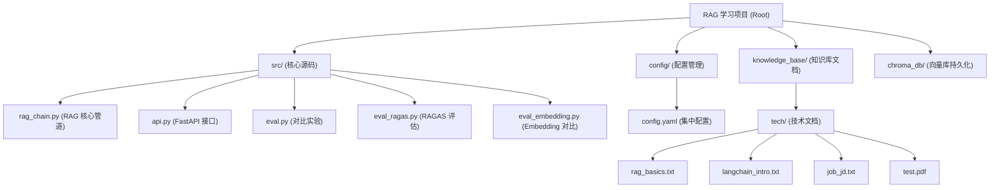

# RAG 学习项目 - AI 上下文文档

> 本地知识库 RAG 问答系统，基于 LangChain + Ollama + Chroma 构建，用于学习 LLM 和 RAG 技术。

## 项目愿景

构建一个完整可运行的本地 RAG（检索增强生成）系统，覆盖文档加载、文本切分、向量化、检索、重排序、生成全链路，用于学习 LLM 和 RAG 技术。

## 架构概览



## RAG 全链路流程

```
文档加载 (TextLoader / PyPDFLoader)
  -> 文本切分 (RecursiveCharacterTextSplitter, chunk=512, overlap=128)
    -> 向量化 (OllamaEmbeddings, bge-m3)
      -> 向量存储 (Chroma, 持久化到 chroma_db/)
        -> 用户提问 -> 问题向量化
          -> 粗检索 (top-k*4=20)
            -> Rerank 精排 (BAAI/bge-reranker-base)
              -> 保留 top_k=5
                -> Prompt 拼接 (context + question)
                  -> LLM 生成 (Qwen3:4b, temperature=0)
                    -> 返回 answer + sources
```

## 模块索引

| 模块路径 | 职责 | 入口文件 |
|----------|------|----------|
| [src/](./src/CLAUDE.md) | RAG 核心源码：管道、API、评估 | `rag_chain.py`, `api.py` |
| [config/](./config/CLAUDE.md) | 集中配置管理（模型、RAG 参数、知识库路径） | `config.yaml` |
| [knowledge_base/](./knowledge_base/CLAUDE.md) | 知识库文档（技术文档、预留扩展目录） | `tech/` 子目录 |

## 技术栈

| 组件 | 选型 | 说明 |
|------|------|------|
| LLM | Qwen3:4b / Qwen3:8b (Ollama) | 本地推理，无需 API Key |
| Embedding | bge-m3 (Ollama) | BAAI 中文多语言 embedding |
| Reranker | BAAI/bge-reranker-base | Cross-encoder 精排模型 |
| 框架 | LangChain | 文档加载、切分、向量化、链式调用 |
| 向量库 | Chroma | 持久化存储，支持 metadata 过滤 |
| API | FastAPI | REST 接口封装（含流式输出） |
| 环境 | Python 3.11 + Windows | conda env: llm |

## 运行与开发

### 环境要求
- Ollama 已安装，模型已拉取：`ollama pull qwen3:4b`、`ollama pull bge-m3`
- Python 3.11+，conda 环境 `llm` 已配置依赖
- 可选：`ollama pull qwen3:8b`（对比实验用）

### 运行方式
```bash
# 运行 RAG 管道（构建索引 + 测试问答）
python src/rag_chain.py

# 启动 API 服务
python -m uvicorn src.api:app --host 0.0.0.0 --port 8000

# 运行对比实验
python src/eval.py

# 运行 RAGAS 评估
python src/eval_ragas.py

# 运行 Embedding 对比
python src/eval_embedding.py
```

### API 接口
- `POST /rag/query` -- 标准 RAG 问答
- `POST /rag/stream` -- 流式 RAG 问答 (SSE)
- `GET /health` -- 健康检查

### 知识库切换
修改 `config/config.yaml` 中的 `knowledge_base` 字段，然后删除 `chroma_db/` 目录并重建索引。

## 测试策略

当前项目没有单元测试框架。评估通过以下脚本实现：
- `eval.py` -- 模型大小(4B vs 8B)、chunk 大小(256/512/1024)、top-k(3/5/10) 对比实验
- `eval_ragas.py` -- RAGAS 量化评估（faithfulness、relevancy、coverage）
- `eval_embedding.py` -- nomic-embed-text vs bge-m3 中文 embedding 效果对比

## 编码规范

- **KISS**: 全链路约 100 行 Python，直接用 LangChain 最简 API
- **DRY**: 配置集中管理在 `config.yaml`，所有代码从中读取参数
- **配置分离**: 知识库路径、模型名、RAG 参数全在 yaml 中，切换场景无需改代码
- **中文注释**: 所有代码注释和 prompt 均使用中文

## AI 使用指南

- 这是一个学习项目，代码修改应保持简洁，避免过度工程化
- 修改 RAG 参数时，只需编辑 `config/config.yaml`
- 修改 LLM/prompt 时，关注 `src/rag_chain.py` 中的 `build_prompt()` 方法
- 向量库数据存储在 `chroma_db/`，修改 embedding 模型后需删除重建
- 评估脚本可独立运行，用于对比不同配置的效果
- Ollama 模型存储在 `D:\AiLearning\OllamaModels`（`OLLAMA_MODELS` 环境变量配置）

## 变更日志

| 日期 | 变更内容 |
|------|----------|
| 2026-05-14 | 初始创建项目 AI 上下文文档 |
